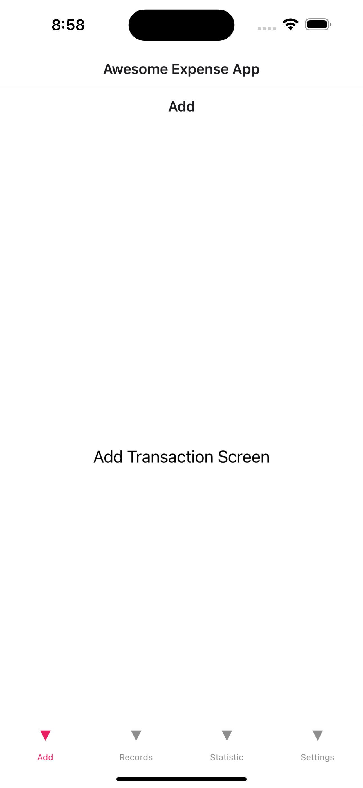

# Mobile Development (CM 3050)

## Concept development 

I am Certified Charted Account (ACCA) by profession and have been working as a finance/accounts person for the last 12 years, therefore, I have a keen interest in the financial application. Accordingly, I have decided to develop an expense application to record and keep track of the day-to-day expenses. The tech used are as follows:

### Tech Stack

**Frontend:** React Native, JavaScript

**Backend:** FastAPI, Python

Backend is created from scratch from the beginning to provide the session JWT token to frontend on providing the correct username and password. There are following three models implemented to keep track of users, expenses and tokens:

#### User Model

“User” model is created with the following fields:
- ID (UUID auto-generated upon addition of new users in the database)
- Username (Unique string for each user)
- Password (Unique string for each user)
- Email ID (Unique string for each user)

#### Expense Model

“Expense” model is created with the following fields:
- ID (UUID auto-generated upon addition of new users in the database)
- Amount (Integer to accept the amount both in positive/negative)
- Description (String to store description for expenses)
- Date (Date auto stored in the data upon creating a new record) 

#### Token Model

- Access Token (String to issue a unique token upon verifying the user credentials)
- Token Type (String to hold the token type, such as active or expired) 

SQLite database is used to store the information from the frontend.

The brief for the **functionality** introduced in the Frontend application is as follows: 

- Login and Logout in the application while storing the token sent from backend using “AsyncStorage”.
- Token is used for future requests from the client to the server and “Login” Context/provider is provided to have logged in state while using the app till the user opts to log out. 
- User Registration using FastAPI backend. Validation rules are provided to ensure clean data is submitted to the database.
- React Navigation (Using Stack and tab navigation)
- Transaction records are fetched from backend and rendered using Lists (Scroll View and Flat list). There - is a unique component created to render the data and provide list of transactions to display.
- Accumulated expenses/income are shown in a container along with last week's expenses transactions are presented in “Line Chart” using "react-native-chart-kit"
- Custom “Alert Message” component is created capable of handling various front/back end messages related to backend error, custom messages or validation errors.
- Filtering the transaction record based on the search term provided by users.

**Future Aspirations**

- Implement a proper state management tool such as Redux etc
- Issue OTP and implement dual authentication for login into the application because of the nature of the application.
- Implement AI model to categorize the expenses/income based on descriptions provided by users.
- Implement functionality to share specific expenses with friends/family or verified users.
- Provide filtering/sorting of transactions based on date or amount.

## Wireframing 
Framer.io is used to wireframe the concept before development, and draw.io is for workflow diagrams. The application is having 5 screens for functionalities as briefed above:

  <figure style="margin-right: 5px">
    
  </figure>
  <figure style="margin-right: 5px">
	  
  </figure>
  <figure>
	  
  </figure>

  <figure style="margin-right: 5px">
	  
  </figure>
  <figure style="margin-right: 5px">
	  
  </figure>
  <figure>
    
  </figure>

There are similar mobile transaction are referred such as Wallet app (Available in Web, IOS and Android). Blue Coin (Available in Android) is referred to get the aspiration related to design and to ensure that it meets the requirements of stakeholders.

## User feedback 

Design-related feedback is obtained from the friend by providing design prototypes prepared using framer.io. The question asked from the audience are as follows:

- How well do you think application design serves the purpose of recording expenses.
- Does statistical visualization using containers and chart will be in better management of expenses.
- Navigation between the screen makes sense and is in line with existing mobile applications.
- Does the application satisfy the security requirements of the end user because it will hold the financial information? 
- The application design is easy to grasp with respect to colour and graphical appearance.

Users have requested one of the vital improvement in the application to implement a feature to upload the bank statements in PDF / Excel files which could automatically fetch the transaction and insert it into the database and also categorizes. This will help the users to keep using application by importing information instead of inserting individual transactions.

## Prototyping

I have implemented initial prototyping using stack navigation and bottom tab navigations using react and basic buttons. Moreover, different sections of the screen are also identified for further additions. The Database was also configured with basic functionality, however, without having a proper JWT system in place.  Images for the initial prototypes are as follows:

  <figure style="margin-right: 5px">
	
  </figure>
  

	
  </figure>
  <figure>
	
  </figure>

  <figure style="margin-right: 5px">
	
  </figure>
  <figure style="margin-right: 5px">
	
  </figure>
  <figure>
	
  </figure>

## Development 
I have followed the CW1 techniques and course videos to built upon a complete working application. The proper file structure is followed as per the React best practice, which includes having separate files for screens, components, context, and utilities. The flow of coding for different features is

    1. Basic Structure Created
    2. Stack Navigation implemented (Authentication flow also defined)
    3. Tab Screens created
    4. Individual Tab screens designed with respective functionality
    5. Session Logout and Deleting token implemented
    6. Tests are defined for different screens/components.

Git controlled is used since the beginning to keep track of the changes, and one additional branch was created (Tab-Screens) to build upon the further for each screen of the application.

MacOS, Expo, VSCode, Iphone Simulators, FastApi uvicorn server are used during coding.

## Unit testing 
I have used “jest-expo” and “react-test-renderer” for implementing the unit test. Since I am using “react-native-async-storage/async-storage” therefore, it was challenging to create test as it was always for AsyncStore. This problem was solved using jest.mock to mock storage. 

README.md include instruction for running the test.

## Evaluation 
Since it was first time I used React/React Native, therefore, I am satisfied with my attempt to prepare a mobile application. I have faced many challenges and breaking of app throughout development, however, resolving each and every bit keep me going. There is always room for betterment in any project, I wanted to implement many features but was unable to complete them because of limited time.

Overall, it was good achievement and I am keen to improve this further for learning purposes.

## Application Walkthrough

## Final Renders

  

    
Signup Screen

    
  

  

    
Login Screen

	  
  

  

    
Add Transaction Screen

	  
  

  

    
Record Screen

	  
  

  

    
Statistic Screen

	  
  

  

    
Settings Screen

    
  

